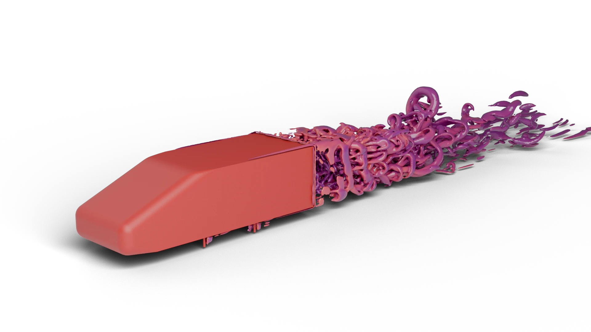

WINDSOR squareback — code_saturne application case
====================================================

This study reproduces the **AutoCFD5 workshop Case 1**: external aerodynamics
around the Windsor squareback body at 2.5° yaw, in a full-scale virtual
wind tunnel. It is provided as an end-to-end code_saturne example covering
two turbulence-modelling strategies on the same mesh:

- `RANS/` — steady k-ω SST RANS, local time stepping.
- `DDES/` — transient SST-DDES hybrid RANS/LES, started from a
  uniform free-stream field.

Both cases share the same ~6.3 M-cell mesh `MESH/c1g1.cgns` and the same
boundary zones. They differ in the turbulence model (k-ω SST vs the same
model with the DDES shielding function enabled in `cs_user_parameters.cpp`),
in the time-stepping scheme, and in the post-treatment carried out by
`cs_user_extra_operations.cpp` (instantaneous coefficients only for RANS;
instantaneous + running time-average for DDES).



Quick start
-----------

```bash
# 1. Download the mesh (~1.2 GB)
./fetch_data.sh

# 2. Run the RANS case
code_saturne run --case RANS

# 3. Run the DDES case (independent of RANS)
code_saturne run --case DDES
```

Aerodynamic coefficients are written to
`<case>/RESU/<run_id>/force_coefficients.csv` by `cs_user_extra_operations.cpp`,
not by code_saturne's default force log (see below).


Physical case
-------------

| Quantity                       | Value                                     |
|--------------------------------|-------------------------------------------|
| Geometry                       | Windsor squareback, full scale, on pins   |
| Yaw angle ψ                    | -2.5° about z (tunnel → vehicle frame)    |
| Domain                         | CFD wind tunnel test section              |
| Free-stream velocity U∞        | 40 m/s                                    |
| Density ρ                      | 1.225 kg/m³                               |
| Molecular viscosity μ          | 1.764 × 10⁻⁵ Pa·s                         |
| Reynolds number (on L_ref)     | ~1.77 × 10⁶                               |
| Frontal area S_ref             | 0.112 m²                                  |
| Reference length L_ref         | 0.6375 m (wheelbase, moment reference)    |
| Moment centre                  | origin (0, 0, 0) — mid-wheelbase, ground  |

Boundary conditions (set in `DATA/setup.xml`):

| Zone                                | BC                               |
|-------------------------------------|----------------------------------|
| Inlet (`Flow.CFDWT.In`)             | uniform velocity 40 m/s in +x    |
| Outlet (`Flow.CFDWT.Out`)           | standard outlet                  |
| Floor (`Flow.CFDWT.Floor`)          | no-slip wall (moving ground convention: see setup.xml) |
| Roof, Left, Right (`Flow.CFDWT.*`)  | symmetry                         |
| Windsor_Body, Base, Pins            | no-slip wall                     |

Reference experimental data (Varney, Loughborough NW dataset) is not
redistributed here; see the AutoCFD5 Case 1 workshop specification for
details on the experimental setup.


Force coefficients pipeline
---------------------------

Coefficients are computed by the user routine
`SRC/cs_user_extra_operations.cpp`, **not** read from code_saturne's
default boundary force log. The routine:

1. Locates the cell nearest the reference probe at `[-2.0, 0.0, 1.3]` m
   (upstream of the body, outside the wake).
2. Computes the local dynamic pressure
   `q_ref = ½ · ρ · |V_probe|²` from the velocity at that probe.
3. Sums pressure and viscous forces and moments on the boundary zones
   `Windsor_Body`, `Windsor_Base`, `Windsor_Pins`.
4. Rotates the resulting force/moment vectors from the tunnel (grid)
   frame into the yawed vehicle frame by ψ = -2.5°.
5. Non-dimensionalises with `q_ref · S_ref` (forces) and
   `q_ref · S_ref · L_ref` (moments).
6. Writes `force_coefficients.csv` in the run directory at every time
   step. For DDES, instantaneous **and** running-mean coefficients are
   reported. The averaging start is expressed in convective times based
   on the body length, `τ_c = L_body / U∞ ≈ 0.0261 s`:

   ```
   t_avg_start = n_tau_transient · L_body / U∞
   ```

   The default `n_tau_transient = 10` (≈ 0.261 s) follows the lower
   bound of typical bluff-body DDES practice (skip 10–20 τ_c before
   averaging, accumulate 20+ τ_c of averaging window). With the default
   `<iterations>30000</iterations>` (≈ 2.4 s ≈ 92 τ_c at dt = 8 × 10⁻⁵ s),
   the running mean activates around iteration 3 263 and accumulates
   ~82 τ_c of statistics by the end of the run.

Reference quantities (`S_ref`, `L_ref`, ρ, ψ) and the probe location are
hard-coded at the top of `cs_user_extra_operations.cpp` to follow the
AutoCFD5 specification verbatim. They are intentionally kept in source
rather than in `setup.xml` so that the file is the single source of truth
for the post-processing convention.


Numerical setup
---------------

| Setting                  | RANS                   | DDES                                       |
|--------------------------|---------------------------|-----------------------------------------------|
| Turbulence model         | k-ω SST                   | k-ω SST + DDES hybrid (`CS_HYBRID_DDES`)      |
| Time stepping            | local, ref. dt 1.75e-5 s  | constant, dt = 8e-5 s                         |
| Iterations               | 3000                      | 30000 (≈ 2.4 s physical, ≈ 92 τ_c)            |
| Initialisation           | reference velocity field  | uniform free-stream field                     |
| Convection scheme        | as defined in `setup.xml` | as defined in `setup.xml`                     |
| Wall treatment           | k-ω SST low-Re (y+ < 1)   | same                                          |
| Time-averaged fields     | —                         | `mean_velocity` etc. activated in `setup.xml` |

The DDES model is enabled programmatically via
`DDES/SRC/cs_user_parameters.cpp`:

```cpp
cs_turb_model_t *turb_model = cs_get_glob_turb_model();
turb_model->hybrid_turb = CS_HYBRID_DDES;
```

The underlying base model (k-ω SST) is configured in `DATA/setup.xml`,
identically for both cases; only the hybrid switch differs. This keeps
the GUI-driven part of the setup interchangeable.


Parallelism
-----------

`DATA/run.cfg` ships modest defaults so the cases run on a typical
workstation: 8 MPI ranks for RANS, 16 for DDES (no OpenMP). They can
be overridden at run time via `code_saturne run -n <procs>` or by
editing `run.cfg`. The mesh has ~6.3 M cells, so the cases scale
comfortably to several hundred MPI ranks; on a cluster, raising
`n_procs` to ~64 (RANS) / ~256 (DDES) is a reasonable target. For
large rank counts, switching the partitioner away from the default
Morton SFC to a graph-based scheme (Scotch, ParMETIS) typically pays
off.


Repository layout
-----------------

```
WINDSOR/
├── README.md            this file
├── hero.webp            preview image used by README.md
├── fetch_data.sh        downloads the mesh
├── MESH/                shared mesh (downloaded, not committed)
│   ├── README.md
│   └── c1g1.cgns        ~1.2 GB
├── RANS/
│   ├── DATA/{setup.xml, run.cfg}
│   └── SRC/cs_user_extra_operations.cpp
└── DDES/
    ├── DATA/{setup.xml, run.cfg}
    ├── SRC/cs_user_extra_operations.cpp
    └── SRC/cs_user_parameters.cpp
```


References
----------

- AutoCFD5 workshop, Case 1 — Windsor squareback at 2.5° yaw.
- Varney, M. et al., Loughborough NW experimental dataset on the Windsor
  body (used as the workshop reference for validation).
- code_saturne v9.1, EDF R&D, https://code-saturne.org
